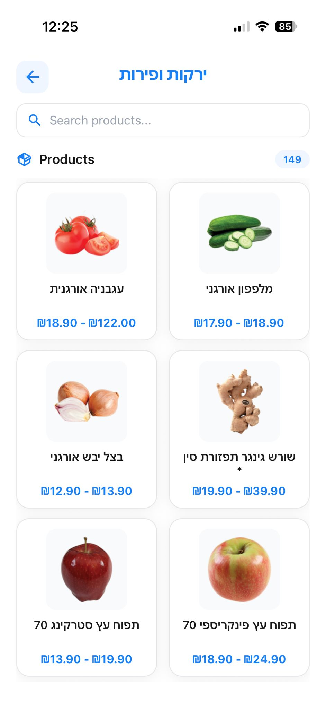
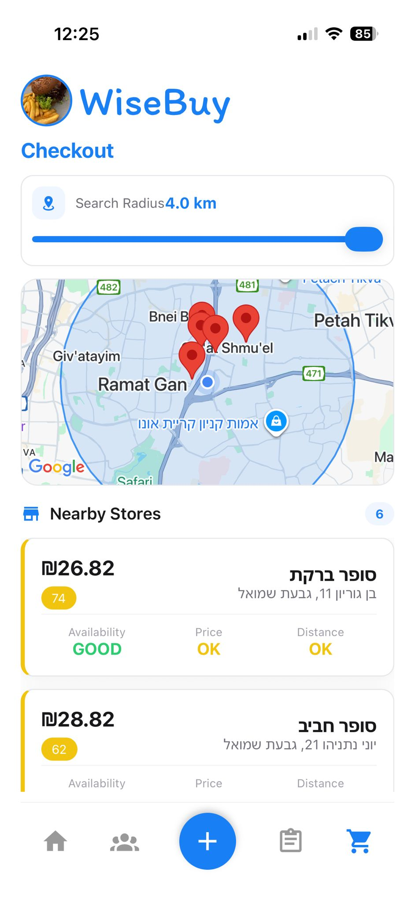
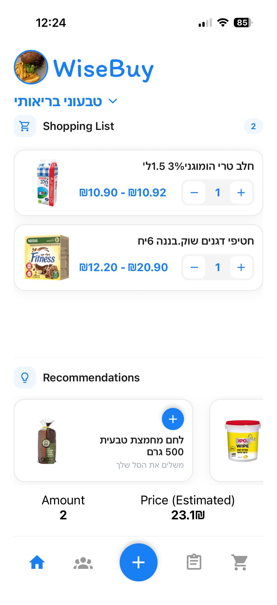

# 🛒 WiseBuy – Smart Grocery Shopping Assistant

WiseBuy is a full-stack smart grocery shopping platform that helps users find the **best nearby stores**, **lowest prices**, and **optimal shopping experience** — all based on real-time data, user location, and collaborative shopping lists.


WiseBuy allows users to create shopping lists, compare grocery prices across supermarkets, and easily decide where to shop using an intuitive mobile interface.

---

## 🚀 Features

- 📍 Location-based store comparison  
- 💰 Smart price aggregation and store scoring  
- 👥 Group shopping and shared shopping lists  
- 🗺️ Interactive checkout map with nearby stores  
- ⚡ Cached scraping for fast and up-to-date results  
- 🧠 Optional ML-powered product recommendations  

---

## 📱 App Screenshots

<p align="center">
    
    
    
    
    
    
    
    
    
</p>

> Screenshots are placeholders and can be replaced with real images from the app.

---

## 🧩 Tech Stack

**Frontend**
- React Native (Expo)
- Expo Router
- Redux Toolkit + RTK Query
- Custom reusable UI components

**Backend**
- Node.js
- NestJS
- MongoDB + Mongoose
- JWT Authentication

**Scraper & ML**
- Python
- Selenium
- Experimental ML-based ranking logic

---

## 🧮 Store Scoring Logic

Each store receives a final score between **1–100** based on multiple factors:

```ts
finalScore =
  priceScore * 0.5 +
  distanceScore * 0.3 +
  availabilityScore * 0.2;
💰 Price – total basket cost
```

📍 Distance – proximity to the user

📦 Availability – number of found items

## 🗺️ Checkout Map
- Displays nearby stores on a map
- Adjustable search radius
- Color-coded store markers

- Best store highlighted automatically


## 🧠 ML Recommendations
The recommendation system is trained using:

User purchase history

- Global product popularity
- Similar user behavior
- Outputs include:
Suggested products
Smart sorting inside the shopping list


## 🔧 Installation & Running the Project
Clone the repository: git clone https://github.com/your-username/wisebuy.git

**Frontend**
```ts
cd wisebuy
cd Frontend
npx expo start -c
```

**Backend**
```ts
cd wisebuy
cd Server
npm run start:dev
```

## 📌 Project Management (Jira)
WiseBuy project board:
https://marksheinberg01.atlassian.net/jira/software/projects/WB/boards/1

